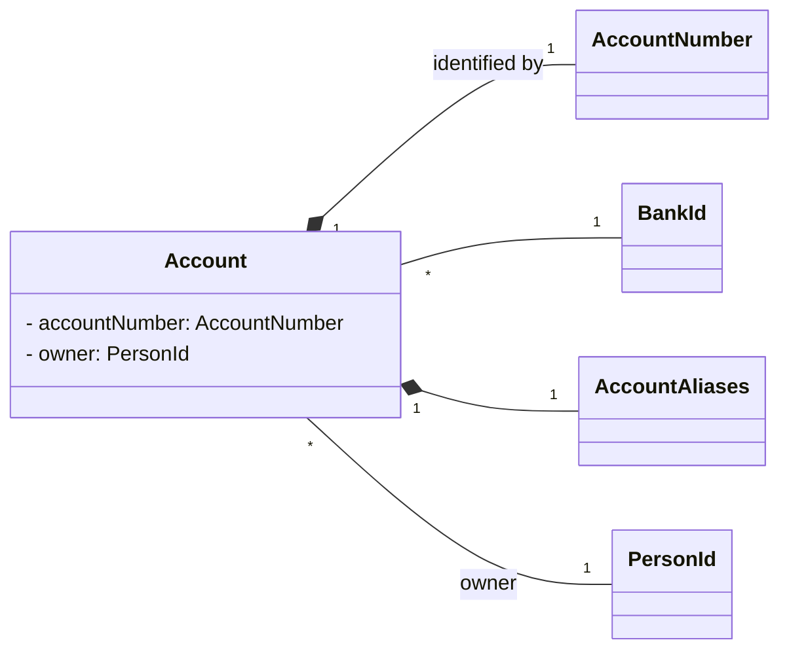

```mermaid
classDiagram
    direction LR
    class Account {
        - accountNumber: AccountNumber
        - owner: PersonId
    }
    class AccountAliases
    class AccountNumber
    class BankId
    class PersonId

    Account "1" *-- "1" AccountNumber : identified by
    Account "*" -- "1" BankId
    Account "1" *-- "1" AccountAliases
    Account "*" -- "1" PersonId: owner
```
